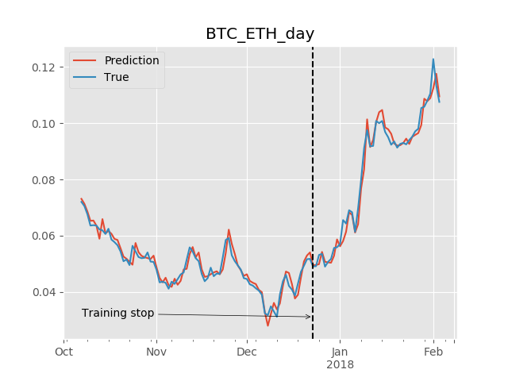

# Time Series Prediction with Machine Learning

A collection of different Machine Learning models predicting the time series, 
concretely the market price for given the currency chart and target.

<p align="center"> 
  
  
</p>

Requirements
------------

Required dependency: `numpy`. Other dependencies are optional, but to diversify the final models ensemble, 
it's recommended to install these packages:  `tensorflow`, `xgboost`.

Tested with python versions: 2.7.14, 3.6.0.

Fetching data
-------------

There is one built-in data provider, which fetches the data from [Poloniex exchange](https://poloniex.com/exchange).
Currently, all models have been tested with crypto-currencies' charts.

Fetched data format is standard security [OHLC trading info](https://en.wikipedia.org/wiki/Open-high-low-close_chart): 
date, high, low, open, close, volume, quoteVolume, weightedAverage.
But the models are agnostic of the particular time series features and can be trained with sub- or superset of these features.

To fetch the data, run [`run_fetch.py`](run_fetch.py) script from the root directory:

```sh
# Fetches the default tickers: BTC_ETH, BTC_LTC, BTC_XRP, BTC_ZEC for all time periods.
$ ./run_fetch.py
```

By default, the data is fetched for all time periods available in Poloniex (day, 4h, 2h, 30m, 15m, 5m) 
and is stored in `_data` directory. One can specify the tickers and periods via command-line arguments.

```sh
# Fetches just BTC_ETH ticker data for only 3 time periods.
$ ./run_fetch.py BTC_ETH --period=2h,4h,day
```

**Note**: the second and following runs *won't* fetch all charts from scratch, but just the update from the last run till now.

Training the models
-------------------

To start training, run [`run_train.py`](run_train.py) script from the root directory:

```sh
# Trains all models until stopped.
# The defaults: 
# - tickers: BTC_ETH, BTC_LTC, BTC_XRP, BTC_ZEC
# - period: day
# - target: high
$ ./run_train.py

# Trains the models for specified parameters.
$ ./run_train.py --period=4h --target=low BTC_BCH
```

By default, the script trains all available methods (see below) with random hyper-parameters, cross-validates each model and
saves the result weights if the performance is better than current average (the limit can be configured). 

All models are placed to the `_zoo` directory (note: it is possible that early saved models will perform much worse than 
later ones, so you're welcome to clean-up the models you're definitely not interested in, because they can only spoil 
the final ensemble).

**Note 1**: specifying multiple periods and targets will force the script to train all combinations of those. 
Currently, the models *do not* reuse weights for different targets. In other words, if set `--target=low,high`, 
it will train *different* models particularly for `low` and for `high`.

**Note 2**: under the hood, the models work with transformed data, 
in particular `high`, `low`, `open`, `close`, `volume` are transform to *percent changes*. Hence, the prediction for these
columns is also *percent changes*.

Machine Learning methods
------------------------

Currently supported methods:
- Ordinary linear model. Even though it's very simple, as it turns out, the linear regression shows pretty good results
  and compliments the more complex models in the final ensemble.
- Gradient boosting (using `xgboost` implementation).
- Deep neural network (in `tensorflow`).
- Recurrent neural network: LSTM, GRU, one or multi-layered (in `tensorflow` as well).
- Convolutional neural network for 1-dimensional data (in `tensorflow` as well).

All models take as input a window of certain size (named `k`) and predict a single target value for the next time step. 
Example:
window size `k=10` means that the model accepts `(x[t-10], x[t-9], ..., x[t-1])` array to predict `x[t].target`. 
Each of `x[i]` includes a number of features (open, close, volume, etc). Thus, the model takes `10 * features` values in
and outputs a single value - percent change for the target column.

Inspecting the model
--------------------

Saved models consist of the following files:
 - `run-params.txt`: each model has the following run parameters:
    - Ticker name, e.g., `BTC_ETH`.
    - Time period, e.g., `4h`.
    - Target column, e.g., `high` (means the model is predicting the next high price).
    - Model class, e.g., `RecurrentModel`.
    - The `k` value, which denotes the input length, 
      e.g., `k=16` with `period=day` means the model needs 16 days to predict the next one.
 - `model-params.txt`: holds the specific hyper-parameters that the model was trained with.
 - `stats.txt`: evaluation statistics (for both training and test sets, see the details below).
 - One or several files holding the internal weights.
 
Each model is evaluated for both training and test set, but the final evaluation score is computed *only from the test set*.
  
Here's the example report:

```
# Test results:
Mean absolute error: 0.019528
SD absolute error:   0.023731
Sign accuracy:       0.635158
Mean squared error:  0.000944
Sqrt of MSE:         0.030732
Mean error:          -0.001543
Residuals stats:     mean=0.0195 std=0.0238 percentile=[0%=0.0000 25%=0.0044 50%=0.0114 75%=0.0252 90%=0.0479 100%=0.1917]
Relative residuals:  mean=1.1517 std=0.8706 percentile=[0%=0.0049 25%=0.6961 50%=0.9032 75%=1.2391 90%=2.3504 100%=4.8597]
```

You should read it like this: 
 - The model is on average `0.019528` or about 2% away from the ground truth percent change (absolute difference),
   but only `-0.001543` away taking into account the sign. In other words, the model underestimates and overestimates the
   target equally, usually by 2%.
 - The standard deviation of residuals is also about 2%: `0.023731`, so it's rarely far off the target.
 - The model is 63% right about the sign of the change: `0.635158`. 
   For example, this means that when the model says *"Buy!"*,
   it may be wrong about how high the predicted price will be, but the price will go up in 63% of the cases.
 - Residuals and relative residuals show the percentiles of error distribution. In particular, in 75% of the cases
   the residual percent value is less than 2.5% away from the ground truth and no more than 124% larger relatively.
   
   Example: if `truth=0.01` and `prediction=0.02`, then `residual=0.01` (1% away) and `relative_residual=1.0` (100% larger).
   
In the end, the report is summarized to one evaluation result, which is `mean_abs_error + risk_factor * sd_abs_error`.
You can vary the `risk_factor` to prefer the models that are better or worse on average vs in the worst case. 
By default, `risk_factor=1.0`, hence the model above is evaluated at `0.0433`. Lower evaluation is better.

Running predictions
-------------------

The [`run_predict.py`](run_predict.py) script downloads the current trading data for the selected currencies and runs an 
ensemble of several best models (5 by default) that have been saved for these currencies, period and target. 
Result prediction is the aggregated value of constituent model predictions.

```sh
# Runs ensemble of best models for BTC_ETH ticker and outputs the aggregated prediction.
# Default period: day, default target: high.
$ ./run_predict.py BTC_ETH
```

License
-------

[Apache 2.0](LICENSE)
